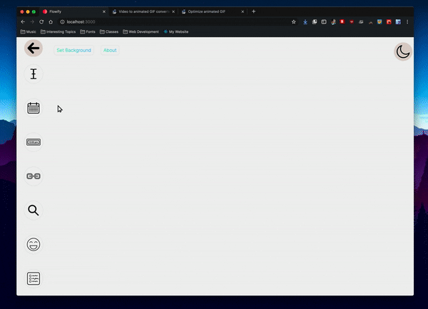
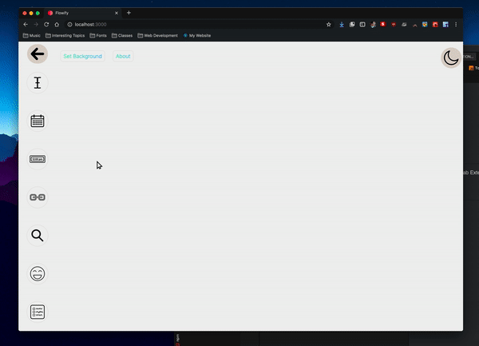

 </img>

<h1 align="center">Flowify</h1>

A Free Flowing New Tab Extension

## 📦 Install

## Previews

### Text Element

</img>

### Date Element

 </img>

### Time Element

 </img>

### Thumbnail Element

 </img>

### Searchbar Element

 </img>

### Joke Element

 </img>

### List Element

 </img>

### Background Options

 </img>

